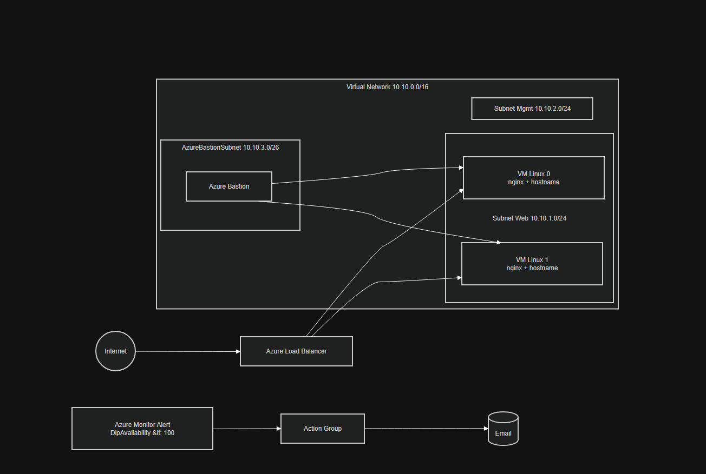
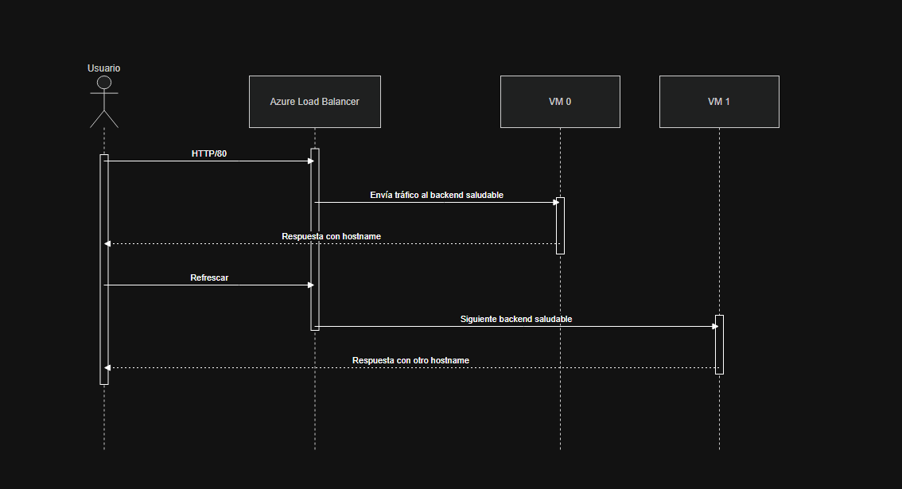
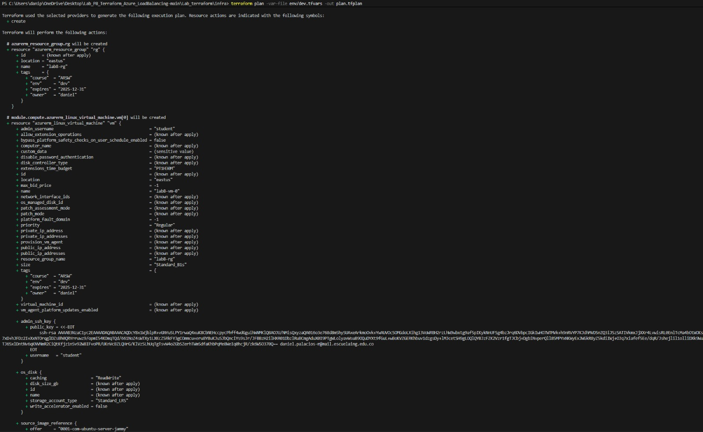
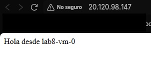
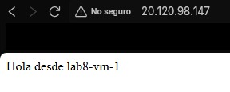
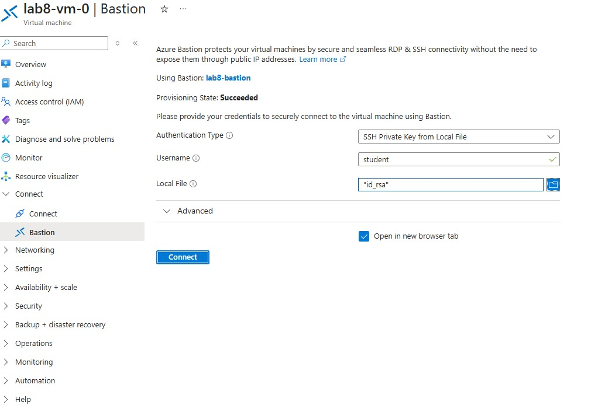
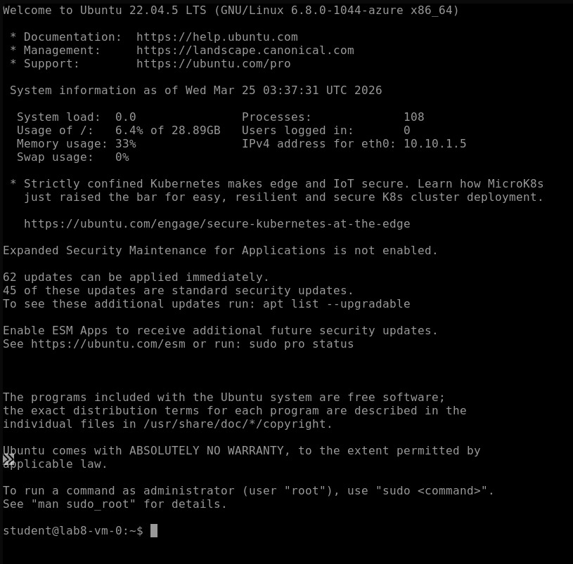
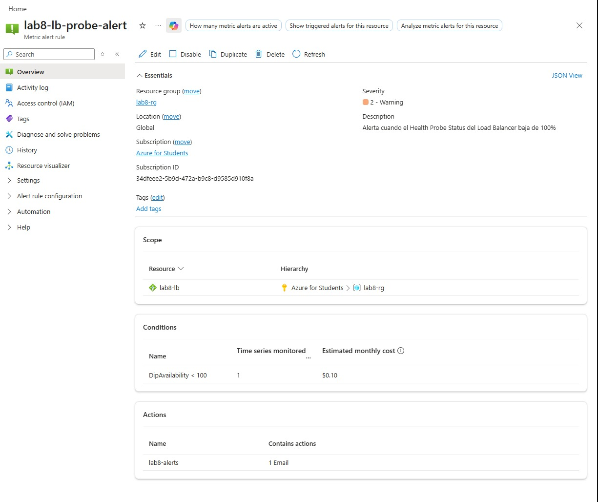
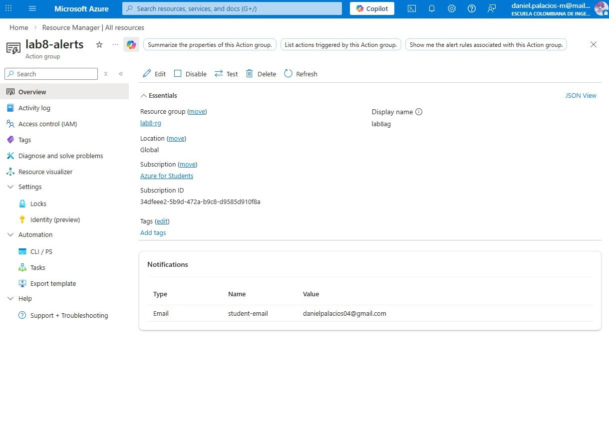

# Lab #8 — Infraestructura como Código con Terraform en Azure
**Autor:** Daniel Palacios Moreno
**Curso:** BluePrints / ARSW  
**Estado:** rama de trabajo con infraestructura modular, retos implementados y CI/CD parcial  
**Última actualización:** 2026-04-12

## Resumen ejecutivo
Este repositorio contiene la evolución del laboratorio de balanceo de carga en Azure usando **Terraform**. La solución final deja una arquitectura reproducible con:

- **Resource Group** dedicado.
- **Virtual Network** con subred para web, subred de gestión y subred para **Azure Bastion**.
- **2 VMs Linux** detrás de un **Azure Load Balancer** público.
- **NSG** con acceso mínimo necesario.
- **cloud-init** para instalar `nginx` y servir una página con el hostname.
- **Azure Bastion** como reto realizado para acceso SSH sin exponer IP pública en las VMs.
- **Azure Monitor alerts** como reto realizado para vigilar el estado del health probe del Load Balancer.
- **Workflow de GitHub Actions** con validación básica, pero **sin OIDC completo** por falta de `AZURE_CLIENT_ID` y del setup necesario en Entra ID.

---

## Qué cambió respecto a `main`
Comparado con la rama `main`, esta versión incorpora y organiza el laboratorio de la siguiente forma:

1. **Infraestructura modularizada** en `modules/`:
   - `modules/vnet`: red virtual y subredes.
   - `modules/compute`: VMs Linux y NICs.
   - `modules/lb`: Load Balancer, probe, regla, NSG y asociaciones.
2. **Wiring principal en `infra/main.tf`** para conectar módulos, variables, tags y cloud-init.
3. **Outputs útiles** para obtener IP pública del LB, nombres de VMs, Bastion y alerta.
4. **Retos implementados**:
   - `azurerm_bastion_host.bastion`
   - `azurerm_monitor_metric_alert.lb_probe_status`
5. **Archivo `cloud-init.yaml`** para dejar las VMs sirviendo una página simple y verificable.
6. **Workflow de GitHub Actions** documentado y activo en versión reducida, con una versión OIDC completa dejada como referencia comentada.

En resumen: la rama ya no es solo una base de Terraform, sino una solución más completa, separada por módulos y con piezas de observabilidad y acceso seguro.

---

## Arquitectura final

### Componentes principales
- **Resource Group**: `${prefix}-rg`
- **VNet**: `10.10.0.0/16`
- **Subred web**: `10.10.1.0/24`
- **Subred de gestión**: `10.10.2.0/24`
- **AzureBastionSubnet**: `10.10.3.0/26`
- **Load Balancer público** con backend pool y health probe TCP/80
- **2 VMs Ubuntu 22.04** con `nginx`
- **NSG** permitiendo HTTP público y SSH solo desde la IP autorizada
- **Action Group + Metric Alert** sobre `DipAvailability`

### Diagrama propuesto

### Diagrama de arquitectura 



### Flujo de petición



---

## Retos realizados

### 1) Azure Bastion
Se implementó **Azure Bastion** para acceder por SSH a las VMs sin necesidad de exponer una IP pública en cada máquina. Esto mejora la postura de seguridad porque:

- evita publicar SSH directamente en las VMs;
- centraliza el acceso administrativo;
- permite seguir entrando a las máquinas incluso si no tienen IP pública.

En Terraform quedó configurado con:

- `azurerm_public_ip.bastion_pip`
- `azurerm_bastion_host.bastion`
- la subred obligatoria `AzureBastionSubnet`

### 2) Alertas de Azure Monitor
Se agregó una **alerta métrica** sobre el Load Balancer para vigilar el estado del probe (`DipAvailability`). La regla dispara notificación cuando el valor baja de `100`, lo que ayuda a detectar rápidamente problemas de salud en los backends.

La implementación incluye:

- `azurerm_monitor_action_group.alerts` con notificación por correo;
- `azurerm_monitor_metric_alert.lb_probe_status`;
- umbral `DipAvailability < 100`.

Esto deja evidencia de monitoreo básico y de una reacción temprana ante fallas del balanceo.

---

## CI/CD y estado del workflow
El archivo `.github/workflows/terraform.yml` documenta dos cosas:

1. **Workflow activo actual**: ejecuta `terraform fmt -check -recursive`, `terraform init -backend=false` y `terraform validate`.
2. **Workflow OIDC completo**: está escrito como referencia, pero permanece comentado.

### Limitación real
El pipeline **no se pudo completar al 100%** porque no se tiene acceso a la variable/credencial necesaria `AZURE_CLIENT_ID`, ni al resto de configuración requerida en Azure para habilitar el flujo OIDC con GitHub Actions.

En otras palabras:

- **Sí hay CI básico funcional** para formateo y validación.
- **No hay CD completo funcional** en GitHub Actions en este tenant.
- **El workflow completo sí quedaría listo** si se contara con:
  - `AZURE_CLIENT_ID`
  - `AZURE_TENANT_ID`
  - `AZURE_SUBSCRIPTION_ID`
  - una App Registration o identidad administrada con federated credentials

Por eso este repositorio deja el **workflow completo OIDC** dentro del mismo archivo como referencia, para activarlo cuando se tenga acceso a esas variables y permisos.

---

## Evidencias reales (`images/`)
Esta sección usa las capturas que ya están en el repositorio para evidenciar el despliegue y las validaciones del laboratorio.

### Plan de Terraform
Ejecución de `terraform plan` con creación de recursos esperados (RG, VMs, LB, NSG, Bastion y alertas):



### Balanceo de carga funcionando
Respuesta del LB mostrando alternancia entre backends:





### Reto 1: Azure Bastion
Conexión por Bastion desde el portal y sesión SSH activa en la VM:





### Reto 2: Alertas de Azure Monitor
Regla métrica del LB y Action Group configurado para notificaciones por correo:





---

## Estructura del repositorio
```text
.
├─ README.md
├─ docs/
│  └─ INSTALL_TERRAFORM.md
├─ images/
│  ├─ action-group.png
│  ├─ alert-rule.png
│  ├─ bastion-connection-azure-console.png
│  ├─ bastion-connection.png
│  ├─ lb-response-vm0.png
│  ├─ lb-response-vm1.png
│  └─ plan-execution.png
├─ infra/
│  ├─ main.tf
│  ├─ providers.tf
│  ├─ variables.tf
│  ├─ outputs.tf
│  └─ cloud-init.yaml
├─ modules/
│  ├─ compute/
│  │  ├─ providers.tf
│  │  ├─ variables.tf
│  │  ├─ outputs.tf
│  ├─ lb/
│  │  ├─ providers.tf
│  │  ├─ variables.tf
│  │  ├─ outputs.tf
│  ├─ vnet/
│  │  ├─ providers.tf
│  │  ├─ variables.tf
│  │  ├─ outputs.tf
└─ .github/
   └─ workflows/
      └─ terraform.yml
```

---

## Requisitos previos
- Cuenta en Azure con permisos suficientes para crear recursos.
- **Azure CLI** (`az`).
- **Terraform >= 1.6**.
- SSH key generada, por ejemplo `ssh-keygen -t ed25519`.
- Cuenta en GitHub para ejecutar el workflow.

---

## Variables principales
Las variables relevantes están definidas en `infra/variables.tf`:

- `prefix`
- `location`
- `vm_count`
- `admin_username`
- `ssh_public_key`
- `allow_ssh_from_cidr`
- `tags`
- `alert_email`

### Ejemplo de `env/dev.tfvars`
```hcl
prefix              = "lab8"
location            = "eastus"
vm_count            = 2
admin_username      = "student"
ssh_public_key      = "~/.ssh/id_ed25519.pub"
allow_ssh_from_cidr = "X.X.X.X/32"
alert_email         = "tu-correo@ejemplo.com"

tags = {
  owner   = "tu-alias"
  course  = "ARSW/BluePrints"
  env     = "dev"
  expires = "2025-12-31"
}
```

---

## cloud-init de las VMs
El archivo `infra/cloud-init.yaml` instala `nginx` y sirve una página con el hostname de cada VM.

```yaml
#cloud-config
package_update: true
packages:
  - nginx
runcmd:
  - echo "Hola desde $(hostname)" > /var/www/html/index.nginx-debian.html
  - systemctl enable nginx
  - systemctl restart nginx
```

---

## Flujo de trabajo local
```bash
cd infra

# Autenticación en Azure
az login
az account show

# Inicialización local del backend remoto
terraform init -backend-config=backend.hcl

# Validaciones
terraform fmt -recursive
terraform validate

# Plan y apply
terraform plan -var-file=env/dev.tfvars -out plan.tfplan
terraform apply "plan.tfplan"

# Verificación del balanceador
curl http://$(terraform output -raw lb_public_ip)
```

### Outputs esperados
- `lb_public_ip`
- `resource_group_name`
- `vm_names`
- `bastion_name`
- `bastion_public_ip`
- `lb_probe_alert_name`

---

## Bootstrap del backend remoto
Si todavía no tienes el backend remoto para el state, puedes crearlo con Azure CLI:

```bash
SUFFIX=$RANDOM
LOCATION=eastus
RG=rg-tfstate-lab8
STO=sttfstate${SUFFIX}
CONTAINER=tfstate

az group create -n $RG -l $LOCATION
az storage account create -g $RG -n $STO -l $LOCATION --sku Standard_LRS --encryption-services blob
az storage container create --name $CONTAINER --account-name $STO
```

Luego crea un `backend.hcl` local con esos datos y úsalo en `terraform init -backend-config=backend.hcl`.

---

## Limpieza
```bash
terraform destroy -var-file=env/dev.tfvars
```

---

## Reflexión técnica breve
- **LB L4 vs App Gateway L7**: aquí se priorizó simplicidad y costo bajo, suficiente para balancear HTTP entre dos backends.
- **SSH por Bastion**: reduce exposición frente a abrir SSH público en cada VM.
- **Alertas**: permiten detectar fallos del probe sin revisar manualmente el portal.
- **CI/CD parcial**: deja validación automática, pero el despliegue automatizado completo depende de permisos y credenciales OIDC que no están disponibles en este tenant.


